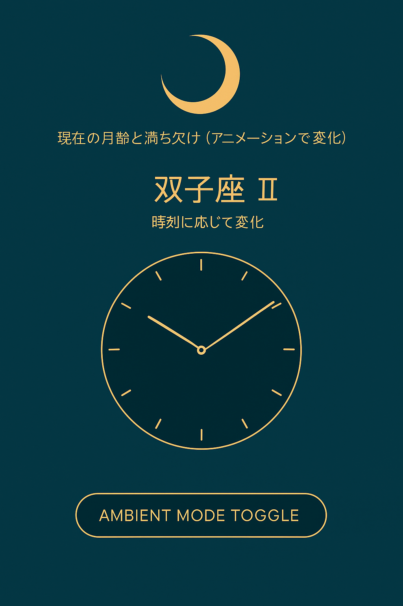

# 🌙 Lunaclock – 時計と月と星座の幻想UIアプリ

> Jetpack Compose で構築された、**時刻・月齢・星座**のリンクを可視化するビジュアル時計アプリ。  
> 現実時間に寄り添いながら、「宇宙のリズム」を感じられるような体験設計を目指しました。

---

## 📸 スクリーンショット

| 時計と月齢 | 星座表示 | アンビエントモード |
|------------|-----------|----------------------|
|  |  |  |

---

## ✨ 主な特徴

- ⏰ **アナログ時計** – Jetpack Compose の Canvas で描画
- 🌒 **月齢表示** – 月の満ち欠けを毎日計算し、視覚的に表示
- ♊ **星座表示** – 現在時刻に対応する12星座のマッピング表示
- 🎨 **幻想的なテーマ** – ダークモードと柔らかなゴールド系配色
- 🌓 **アニメーション** – 月相変化を滑らかに演出（今後拡張予定）
- 🔘 **アンビエントモード** – 背景やUIの切替で雰囲気を一変

---

## ⚙️ 技術スタック

| 技術 | 概要 |
|------|------|
| Kotlin | メイン開発言語 |
| Jetpack Compose | UI構築、Canvas描画、アニメーション |
| Material3 | UIテーマとアクセシビリティ準拠 |
| Java Time API | 時刻処理、月齢・星座の計算基盤 |

---

## 🧠 コンセプト背景

> “実用性” と “詩的な体験” を両立させるデザインとは？  
>  
> 「時計」を単なる時間の表示ではなく、**月と星のリズムを感じる装置**として再定義しました。  
>  
> 見た目だけでなく、**Jetpack Composeの状態管理・描画API**を活かして、思索と実装を往復しながら構築しています。

---

## 🔭 今後の開発予定

- [ ] GPS連動で現在地の**月の出・入り**を表示
- [ ] OpenWeather APIと連携し、**天気に応じた背景変化**
- [ ] **ホームウィジェット**版の対応（Jetpack Glance）
- [ ] Compose Multiplatform で **PCやタブレット**にも展開
- [ ] **背景音の導入**（朝・夜でサウンド変更）

---

## 🚀 起動方法

```bash
git clone https://github.com/your-username/lunaclock.git
cd lunaclock
./gradlew installDebug
